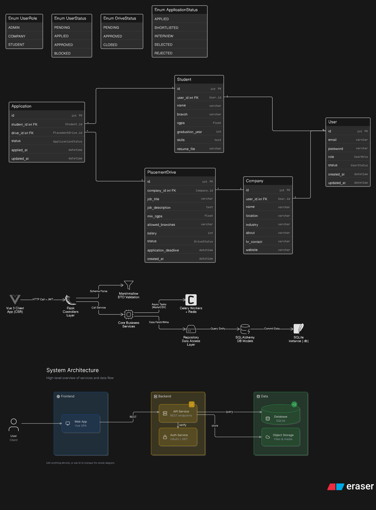

# Placement Portal Application

<div align="center">
  <strong>A comprehensive Campus Placement Management System.</strong>
  <br />
  <em>Connecting Students, Companies, and Administrators into a unified, high-performance platform.</em>
</div>

---

## Key Features

*   **Multi-Role RBAC:** Secure JWT-based authentication for Students, Companies, and Sudo Admins.
*   **Admin Dashboard:** Approve or reject company registrations and monitor all placement activities seamlessly.
*   **Student Portal:** Create profiles, upload resumes, view approved placement drives, and apply for jobs effortlessly.
*   **Company Portal:** Post job drives, set strict eligibility criteria, and review or shortlist student applications.
*   **Background Jobs (Celery + Valkey/Redis):**
    *   Automated Daily Interview Reminders via Email.
    *   Automated Monthly Placement Analytics Reports for Companies.
    *   Asynchronous CSV Exports for large application datasets.
*   **API Optimization:** High-traffic endpoints are cached using Redis & Flask-Caching to minimize database load and reduce latency.

## Technology Stack

**Frontend (Client):**
*   Vue.js 3 (Composition API)
*   Vuex (State Management)
*   Vue Router
*   Premium Vanilla CSS Design System

**Backend (Server):**
*   Python Flask (REST API)
*   Flask-SQLAlchemy (ORM) & SQLite
*   Flask-JWT-Extended (Security)
*   Celery & Valkey/Redis (Background Tasks & Message Broker)
*   Flask-Caching (Performance)

## System Architecture


*Note: The architecture follows a strict Controller-Service-Repository pattern for maximum scalability and clean code separation.*

## Installation & Setup

We use a `Makefile` to automate the installation process for both the backend and frontend.

### 1. Run Setup
```bash
make setup
```

### 2. Configure Environment Variables
Create a `.env` file in the root directory (refer to `.env.example`):
```env
SECRET_KEY=your-secret-key-here
JWT_SECRET_KEY=your-jwt-secret-key-here
DEV_DATABASE_URL=sqlite:///db_name_dev.db
PROD_DATABASE_URL=sqlite:///db_name_prod.db
FLASK_ENV=development
REDIS_URL=redis://localhost:6379/0
MAIL_USERNAME=email-id
MAIL_PASSWORD=you-app-16-digit-app-pass
```

## Running the Application (Local Development)

To run the complete stack, open separate terminal instances and use the following Make commands:

**Terminal 1: Start Valkey/Redis Server**
```bash
make run-valkey
```

**Terminal 2: Start Flask Backend**
```bash
make run-backend
```

**Terminal 3: Start Celery Worker (Background Jobs)**
```bash
make run-celery
```

**Terminal 4: Start Celery Beat (Scheduled Jobs)**
```bash
make run-celery-beat
```

**Terminal 5: Start Vue Frontend**
```bash
make run-frontend
```

---
*Developed by the-parvez-16.*